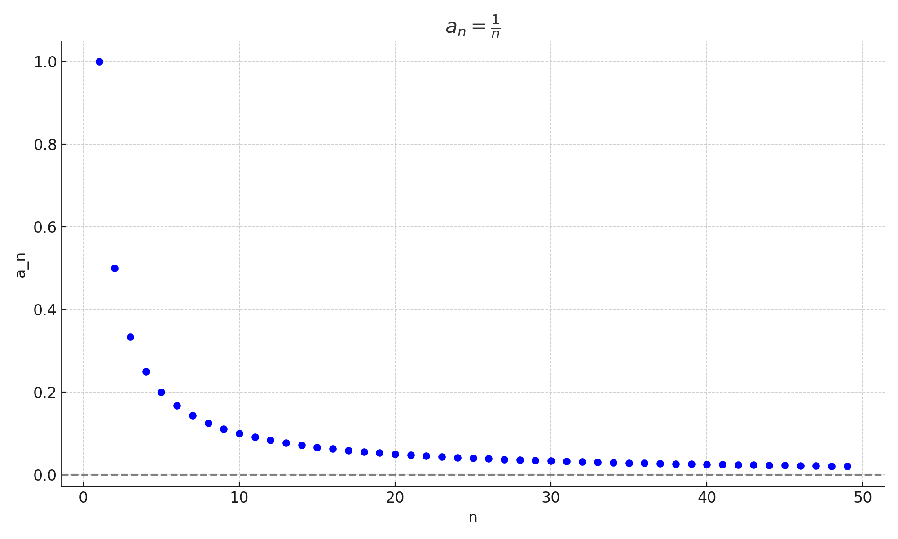

<!-- command: render -->
<!-- command: grid -->
# Lesson: Limits of Infinite Sequences

## Part I: What Is a Limit?

- A **limit** describes the value that a sequence is approaching as $n$ becomes very large.

- Notation:
  $$
  \lim_{n \to \infty} a_n
  $$

- This means: "What value is $a_n$ getting closer and closer to as $n$ gets larger?". This only has an answer if the values of $a_n$ get arbitrarily close to a single number as $n$ increases. We say that the sequence **converges**.

- When the values of $a_n$ grow more and more positive without bound we say that the limit approaches $\infty$.

- When the values of $a_n$ grow more and more negative without bound we say that the limit approaches $-\infty$.

- When the values are bounded but do not converge to a single value, then we say that "the limit does not exist!" (And plan to watch *Mean Girls* again).

- If the values do not approach a finite number—either because they grow without bound or oscillate—the sequence is said to diverge.

### Graphical Interpretation

- When you graph the terms of a sequence as points $(n, a_n)$, the **limit** is the horizontal value that the points approach as $n$ increases.

- If the points level off and appear to settle near a specific $y$-value, that value is the limit.

- If the points grow without bound or bounce back and forth, the limit may **not** exist.

**Example Graphs:**

- $a_n = \frac{1}{n}$  
  

---

## Part II: Key Ideas to Know

1. If $k > 0$, then:
   $$
   \lim_{n \to \infty} \frac{1}{n^k} = 0
   $$

2. If $-1 < r < 1$, then:
   $$
   \lim_{n \to \infty} r^n = 0
   $$

3. You can **usually move limits inside functions**:

   - If $\lim_{n \to \infty} a_n = L$, then:
     $$
     \lim_{n \to \infty} \sqrt{a_n} = \sqrt{L},
     \quad
     \lim_{n \to \infty} \ln(a_n) = \ln(L)
     $$

**Summary: How Sequences Shrink**

- If the denominator grows faster than the numerator, the limit is usually 0.

- If you're raising a number between -1 and 1 to higher powers, it shrinks toward 0.

- You can often move limits inside functions like square roots or logarithms if the limit exists and the function is defined there.

---

## Part III: Finding Limits of Sequences

1. $\lim_{n \to \infty} \frac{5}{n}$  
\vspace{3cm}

2. $\lim_{n \to \infty} \frac{2n + 1}{n^2 + 3}$  
\vspace{3cm}

3. $\lim_{n \to \infty} \left(\frac{3}{4}\right)^n$  
\vspace{3cm}

4. $\lim_{n \to \infty} \frac{n^2 + 5n}{n^2 - 3n + 1}$  
\vspace{3cm}

5. $\lim_{n \to \infty} \sqrt{\frac{1}{n}}$  
\vspace{3cm}

6. $\lim_{n \to \infty} \left[  3+\frac{6}{n^3+4} \right]$
\vspace{3cm}

7. $\lim_{n \to \infty} \log_4\left(\frac{16n+9}{n+1}\right)$
\vspace{3cm}

8. $\lim_{n \to \infty} \cos(e^{-n})$
\vspace{3cm}

Find the limit of these sequences or state that the limit does not exist

9. 1, 4, 9, 16, $\dots$
\vspace{3cm}

10. 1/2, -1/4, 1/8, -1/16, $\dots$
\vspace{3cm}

11. $t_n=\sin(\pi \cdot n)$
\vspace{3cm}

---

## Part IV: When Limits Do Not Exist

A limit **does not exist** if:
- The sequence grows without bound
- The sequence oscillates

Examples:

12. $\lim_{n \to \infty} n$  
\vspace{3cm}

13. $\lim_{n \to \infty} (-1)^n$  
\vspace{3cm}

14. $\lim_{n \to \infty} \cos(n)$  
\vspace{3cm}

15. $\lim_{n \to \infty} \frac{(-2)^n}{n}$  
\vspace{3cm}

16. $\lim_{n \to \infty} \ln(n)$  
\vspace{3cm}

**Summary: When Limits Break Down**

- A sequence does not have a limit if it:

  - Grows without bound (positive or negative)
  
  - Oscillates forever without settling down (like (-1)^n or cos(n))
  
- In those cases, we say "the limit does not exist" even if the values stay bounded.

---

\newpage

## Part V: Review – Multiple Choice and True/False

**1.** What is the limit of the sequence $a_n = \frac{5n + 3}{n + 2}$ as $n \to \infty$?

A) 5  
B) 1  
C) 0  
D) The limit does not exist  
\vspace{2cm}

**2.** True or False: If $a_n = (-1)^n$, then the sequence has a limit of 0.  
\vspace{2cm}

**3.** Which of the following sequences has a limit of 0?

A) $a_n = \frac{1}{n^2}$  
B) $a_n = 1 + \frac{1}{n}$  
C) $a_n = (-2)^n$  
D) $a_n = \cos(n)$  
\vspace{2cm}

**4.** True or False: If $\lim_{n \to \infty} a_n = L$, then $\lim_{n \to \infty} \sqrt{a_n} = \sqrt{L}$, as long as $L \ge 0$.  
\vspace{2cm}

## Part VI: Reflection

- What does it mean for a sequence to have a limit?  
\vspace{3cm}

- How can you recognize when a limit is zero?  
\vspace{3cm}

- How can you tell when a limit does not exist?  
\vspace{3cm}
