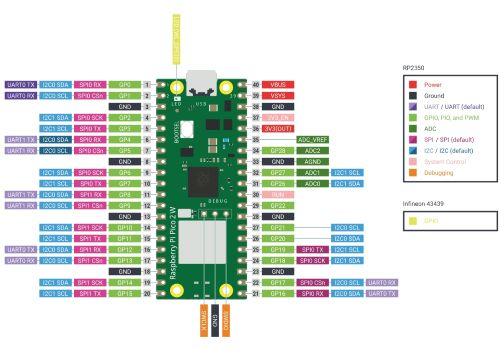

<!-- command: render -->

# Lesson Plan – Day 3  
**Course:** Engineering: Electronics and Computer Programming  
**Duration:** 70 minutes  
**Topic:** Log Ride Analogy, Breadboard Basics, and Blinking an LED  

---

## Objectives

By the end of this lesson, students will:
1. Describe how basic electronic components affect current and voltage using a log ride analogy.  
2. Identify key parts of the Raspberry Pi Pico W pinout, including GPIO and power pins.  
3. Explain how a breadboard connects circuits internally.  
4. Build and code a simple LED blinking circuit using MicroPython.  
5. Predict LED behavior based on different code snippets.

---

## Materials

- Raspberry Pi Pico W (1 per student or pair)  
- Breadboard, LED, 220 ohm resistor, jumper wires  
- USB cables  
- Projector with Pico pinout diagram  
- Whiteboard  

---

## Vocabulary
Resistor, diode, capacitor, switch, DC motor, GPIO pin, GND, 3V3, VBUS, VSYS, breadboard, anode, cathode.

---

## Detailed Lesson Outline

### 1. Opening: Log Ride Analogy (10 minutes)

Discuss how each component affects the flow:

| Component | Log Ride Analogy | Effect |
|----------|------------------|--------|
| Resistor | Narrow section or uphill slope | Reduces flow; dissipates energy |
| Diode | One-way gate | Allows flow only in one direction |
| Capacitor | Side pool that fills then empties | Stores and releases charge |
| Switch | Gate that opens/closes | Starts or stops flow |
| DC Motor | Water wheel | Converts flow into rotation |

---

### 2. Raspberry Pi Pico W Pinout (10 minutes)



Explain:

| Pin Type | Meaning |
|----------|---------|
| GPIO (GP0–GP28) | Programmable pins for input/output |
| GND | Electrical ground reference |
| 3V3(OUT) | Regulated 3.3 V output |
| VBUS | 5 V from USB |
| VSYS | System power input (battery or external supply) |
| 3V3(EN) | Regulator enable (leave unconnected) |
| RUN | Reset pin |

---

### 3. Breadboard Explanation (10 minutes)

Explain:
- Long power rails (vertical), usually + and –  
- Middle rows connected in groups of five  
- The center divider breaks horizontal continuity  

Demonstrate by inserting a resistor and showing continuity across rows.

---

### 4. Predict-the-Behavior Activity (7 minutes)

Students examine code and predict LED behavior.

Code A:
```python
led.value(1)
time.sleep(1)
led.value(1)
time.sleep(1)
```

Code B:
```python
while True:
    led.toggle()
    time.sleep(0.1)
```

Code C:
```python
while True:
    led.value(1)
    time.sleep(0.2)
    led.value(0)
    time.sleep(0.5)
```

Discuss predictions as a class.

---

### 5. Build the Blink Circuit (15 minutes)

Steps:
1. Connect GP15 → resistor → LED anode.  
2. LED cathode → GND.  
3. Confirm correct polarity.

---

### 6. Write and Run Blink Code (15 minutes)

In Thonny, create `blink.py`:

```python
from machine import Pin
import time

led = Pin(15, Pin.OUT)

while True:
    led.value(1)
    time.sleep(0.5)
    led.value(0)
    time.sleep(0.5)
```

Discuss blink rate and logic.

---

## Closing (3 minutes)

Ask:
- What helped electricity make more sense today?  
- Describe one pin on the Pico W and what it does.

Preview next class: measuring voltage and current.

---

## Assessment
- Breadboard wiring accuracy  
- Working blink circuit  
- Participation in prediction activity

---
