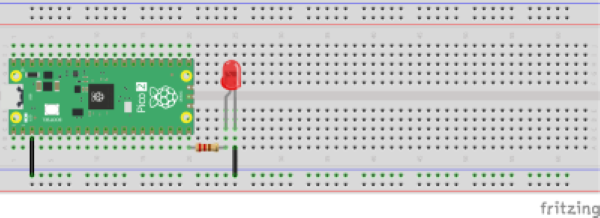
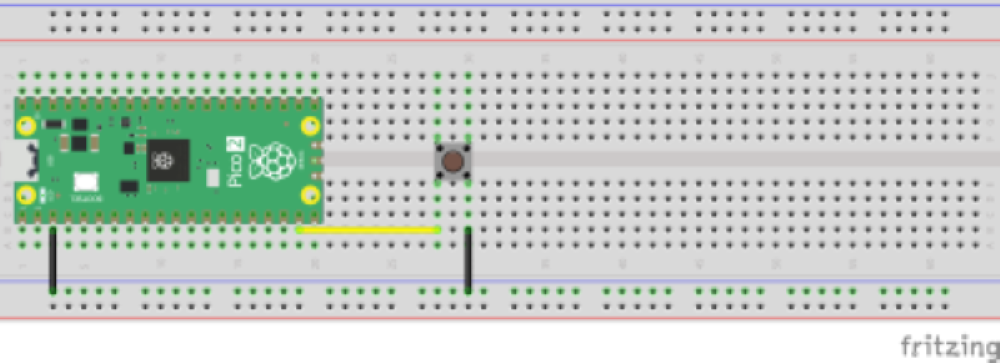

<!-- command: render -->

# Day 4 Student Handout  
**Topic:** Flashing Firmware, Button Inputs, Pull-Up/Pull-Down Resistors, and LED Control

---

## 1. Flashing MicroPython Firmware onto the Raspberry Pi Pico 2 W

Follow these steps:

1. Hold down the **BOOTSEL** button on the Pico 2 W.
2. While holding, plug it into your computer with a USB cable.
3. A new storage device will appear on your computer.
4. Drag and drop the MicroPython firmware `.uf2` file onto that drive.
5. The Pico will reboot and be ready for programming.

**Official MicroPython Firmware Install Tutorial Page:**  

https://projects.raspberrypi.org/en/projects/getting-started-with-the-pico/3


---

## 2. Blinking an LED

**Circuit:**

- GP15 → resistor → LED anode  
- LED cathode → GND

**Space for Picture: LED blink circuit layout**  



**Code:**

```python
from machine import Pin
import time

led = Pin(15, Pin.OUT)

while True:
    led.value(1)
    time.sleep(0.5)
    led.value(0)
    time.sleep(0.5)
```

---

## 3. Button Input and Pull-Up/Pull-Down Resistors

### Why We Need Pull-Ups or Pull-Downs

A pin configured as an input can “float,” meaning it does not read a stable HIGH or LOW value.  
A **pull-up resistor** keeps the pin HIGH until the button connects it to ground.  
A **pull-down resistor** keeps the pin LOW until the button connects it to 3.3 V.

We will use the **internal pull-up resistor** built into the Pico.

### Button Circuit:

- One side of button → GND  
- Other side → GP14  

The internal pull-up keeps the pin HIGH unless the button is pressed.

  


---

## 4. Code to Read the Button

```python
from machine import Pin
import time

button = Pin(14, Pin.IN, Pin.PULL_UP)

while True:
    if button.value() == 0:
        print("Button pressed")
    else:
        print("Button released")
    time.sleep(0.2)
```

---

## 5. Combine Input and Output


Create a circuit that:

- Reads the button  
- Lights the LED **only when the button is pressed**

If you haven't used python with if-else commands here is a short primer on how to do that.

### Primer: Using if-else in Python

Conditional statements allow a program to make decisions based on conditions.

---

#### 1. Basic if Statement

```python
x = 10

if x > 5:
    print("x is greater than 5")
```

---

#### 2. if-else Statement

```python
temperature = 20

if temperature > 25:
    print("It is warm outside.")
else:
    print("It is not very warm today.")
```

---

#### 3. if-elif-else Chain

```python
score = 85

if score >= 90:
    print("A")
elif score >= 80:
    print("B")
elif score >= 70:
    print("C")
else:
    print("Below C")
```

---

#### 4. Using Variables and Input in Conditions

```python
name = input("What is your name? ")

if name == "Alice":
    print("Hello, Alice!")
else:
    print("Hello, stranger.")
```

---

#### 5. Comparison Operators

| Operator | Meaning |
|----------|---------|
| == | equal to |
| != | not equal to |
| > | greater than |
| < | less than |
| >= | greater or equal |
| <= | less or equal |

Example:

```python
value = 12

if value != 10:
    print("Value is not 10")
```

---


#### 6. Combining Conditions

```python
x = 7

if x > 5 and x < 10:
    print("x is between 5 and 10")
```

```python
color = "red"

if color == "red" or color == "blue":
    print("Primary color")
```

---

#### 7. Indentation Is Important

Python uses indentation to show which code belongs to which block.

---

#### 8. Summary

- Use `if` to test a condition.  
- Use `elif` for additional conditions.  
- Use `else` for the default case.  
- Conditions must evaluate to True or False.  
- Indentation defines structure.


---

## 6. Summary of Today’s Concepts

- How to install firmware on the Pico 2 W  
- How to blink an LED with MicroPython  
- How to read a button input  
- What pull-up and pull-down resistors do  
- How to combine input and output signals  

---

## 7. Homework

1. Explain in writing why pull-up resistors are needed.
2. Modify the LED-Button program so the LED blinks twice when the button is pressed.


